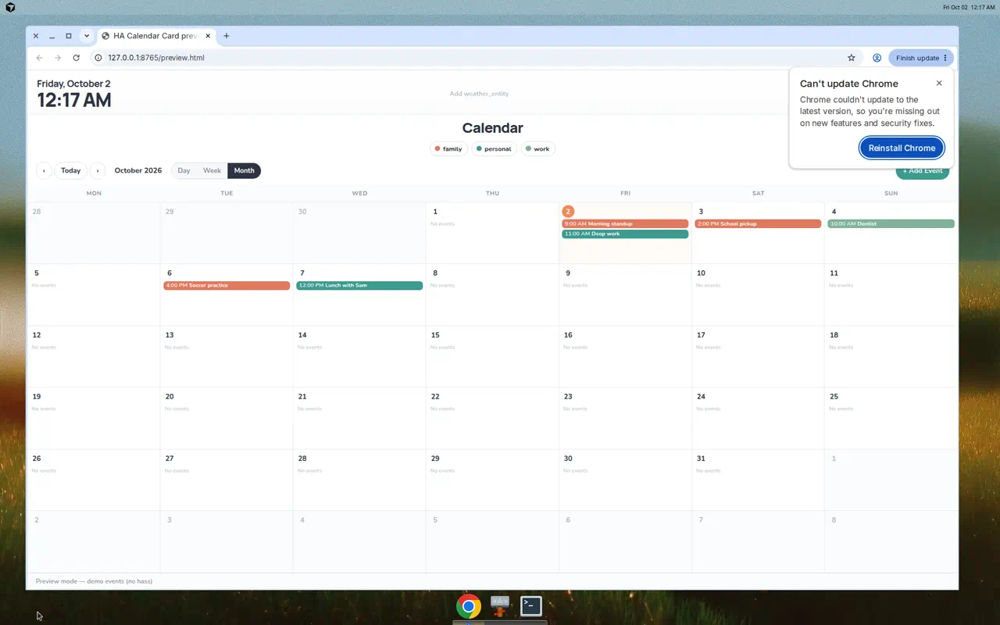

# HA Calendar

Home Assistant calendar project: custom Lovelace card + companion reminders integration.

Inspired by Daylight/Skylight aesthetics — **own codebase**, not a fork of those products.



## Status

- **Card v0.7.2** — filter pills, event chips, and form calendar indicators use each calendar’s Home Assistant color (entity registry `options.calendar.color`); built-in palette only when HA has none. Includes v0.7.1 panel/mobile single-scroll layout, weather config alias, recurring RRULE, Skylight-style UI, safe cross-calendar moves (one-off), HACS packaging, optional reminder hooks
- **Integration v0.1.0** — `custom_components/ha_calendar_reminders` scaffold (storage + services + best-effort scheduler)
- Notify delivery is **best-effort** until validated on your stack. Recurring **cross-calendar moves** remain blocked (prefer clear UX over partial series copies).
- Event notifications can stay on your existing HA automations — the reminder integration is optional.
- Calendar colors: set under **Settings → Entities → calendar.*** (or the calendar entity more-info color control). After changing a color in HA, the card picks it up on refresh / entity-registry update.

## Install the card via HACS (custom repository)

Private / custom-repo install — not yet in the HACS default store.

1. **HACS → Frontend** (Dashboard) → **⋮ → Custom repositories**
2. URL: `https://github.com/Zachre01/HACalendar`
3. Category: **Dashboard** (plugin)
4. Download **HA Calendar Card**, refresh Lovelace
5. Add the card (see [Card YAML](#card-yaml))

`hacs.json` targets the **card plugin only**. The integration is installed separately (below).

### Manual card install (`/config/www`)

1. Take `ha-calendar-card.js` from a [Release](https://github.com/Zachre01/HACalendar/releases) or `npm ci && npm run build`
2. Copy to `config/www/ha-calendar-card.js`
3. Lovelace resource:

```yaml
resources:
  - url: /local/ha-calendar-card.js?v=0.7.2
    type: module
```

## Install the reminders integration

Phase 2 companion — owns per-event reminder rules and firing. Card stays the UI.

1. Copy `custom_components/ha_calendar_reminders/` → `config/custom_components/ha_calendar_reminders/`
2. Restart Home Assistant
3. **Settings → Devices & services → Add integration → HA Calendar Reminders**
4. Optional: default `notify.*` service + minutes-before
5. Open an event in the card — a **Reminder** section appears when services are available

Service contract: [`docs/reminders-api.md`](docs/reminders-api.md)  
Component notes: [`custom_components/ha_calendar_reminders/README.md`](custom_components/ha_calendar_reminders/README.md)

> Delivery uses in-process timers + `notify` calls. Do **not** treat this as guaranteed notification reliability yet.

## Card YAML

**Full-screen dashboard tip:** use a Lovelace view with `type: panel` so the calendar fills width **and** height. The HA page should not scroll — only the month/week/day body under the header chrome scrolls when content overflows. Masonry / sections views still work — the card keeps a sensible min-height there.

```yaml
# View (recommended for a dedicated calendar dashboard)
title: Calendar
path: calendar
type: panel
cards:
  - type: custom:ha-calendar-card
    title: Calendar
    entities:
      - calendar.bills
      - calendar.birthdays
      - calendar.zach
      - calendar.taylor
      - calendar.odin
      - calendar.kyode
      - calendar.torn
      - calendar.calendar
    initial_view: month
    weather_entity: weather.forecast_home
    # weather: weather.forecast_home   # alias also accepted
    # reminder_notify_service: notify.mobile_app_phone
    # reminder_minutes_before: 30
```

Card-only snippet (e.g. masonry):

```yaml
type: custom:ha-calendar-card
title: Calendar
entities:
  - calendar.family
  - calendar.personal
  - calendar.work
initial_view: month
weather_entity: weather.home
```

| Option | Default | Notes |
| --- | --- | --- |
| `title` | `Calendar` | Centered brand / header label |
| `entities` | placeholders | List of `calendar.*` entity ids (filter pills) |
| `initial_view` | `month` | `month`, `week`, or `day` |
| `weather_entity` | — | **Canonical** optional `weather.*` for header + month chips |
| `weather` | — | Alias for `weather_entity` (same effect) |
| `day_start_hour` / `day_end_hour` | `6` / `22` | Visible hour range (day/week) |
| `reminder_notify_service` | `notify.mobile_app_phone` | Prefill for reminder form |
| `reminder_minutes_before` | `30` | Prefill for reminder form |
| `show_demo_when_empty` | `false` | Dev-only demo blocks |

### Weather

Canonical key is **`weather_entity`**. The shorter `weather:` key is accepted as an alias and normalized at config time.

Forecasts prefer the entity’s `forecast` attribute when present; on modern Home Assistant (attribute removed) the card calls `weather.get_forecasts` (`daily` → `twice_daily` → `hourly`) so the header strip and month day chips stay populated.

### Recurring events

- **Create** with Repeat: daily / weekly / monthly / yearly (optional until date). Sent as RFC 5545 `rrule` via websocket `calendar/event/create` (required — the REST `calendar.create_event` service does not accept `rrule`).
- **Edit** a series with scope: this occurrence, this and future (`THISANDFUTURE`), or entire series.
- Month/week/day mark repeating events with a **↻** indicator.
- **Cross-calendar moves stay blocked** for recurring events (clear UX; avoids orphaning instances). Same-calendar edits work.

### Refresh behavior

Events reload on **visible range / view change**, **after create/edit/move**, and on a **gentle 60s interval**. The card no longer refetches on every Home Assistant `hass` update (that previously caused ~2s flicker). The clock ticks independently; weather condition/temp reads live from `hass.states`, and forecasts refresh on the same gentle interval (or via `get_forecasts` when needed).

### Calendar colors

Filter pills, month/week event chips, and the event-form calendar indicators use each calendar’s color from Home Assistant (entity registry `options.calendar.color`, same source as the built-in calendar card). If HA has no color set, the card falls back to a deterministic pastel palette by config order. Registry updates (including changing a calendar color in HA) refresh the card colors without a full page reload when the websocket event is available.

## Cutting a card release (maintainers)

```bash
npm ci
npm run release:check
git tag v0.7.2
git push origin v0.7.2  # .github/workflows/release.yml attaches JS assets
```

HACS plugin assets: `ha-calendar-card.js`, `HACalendar.js` (repo-name match). No `zip_release`.

## Develop (card)

```bash
npm install
npm run build
npm run watch
npm run typecheck
```

## Cross-calendar moves (HA limitation)

Home Assistant **cannot** move an event from one `calendar.*` entity to another in place. The card does it for you on **any** configured source → **any** other configured target (not a special pair):

1. Edit an event → change the **Calendar** dropdown → **Move & save**
2. Card **creates** the event on the target calendar  
3. Confirms the new copy (refetch → uid)  
4. **Deletes** from the source calendar  

Never delete-first. If delete fails after create, both copies remain and a **Remove old copy** banner appears. Recurring moves stay blocked.

## License

MIT
